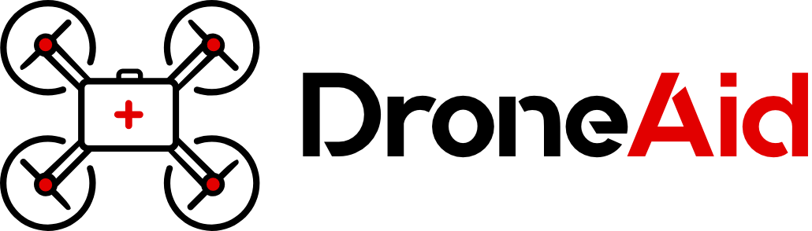
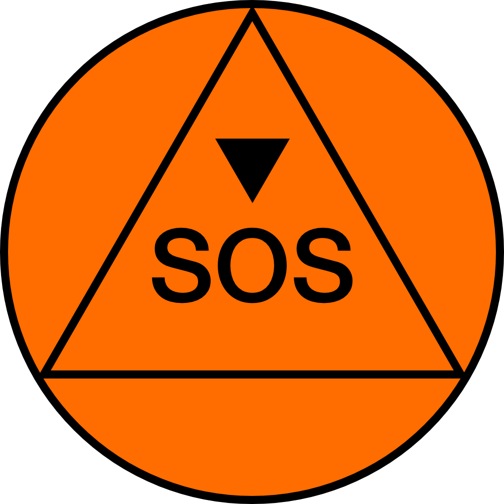
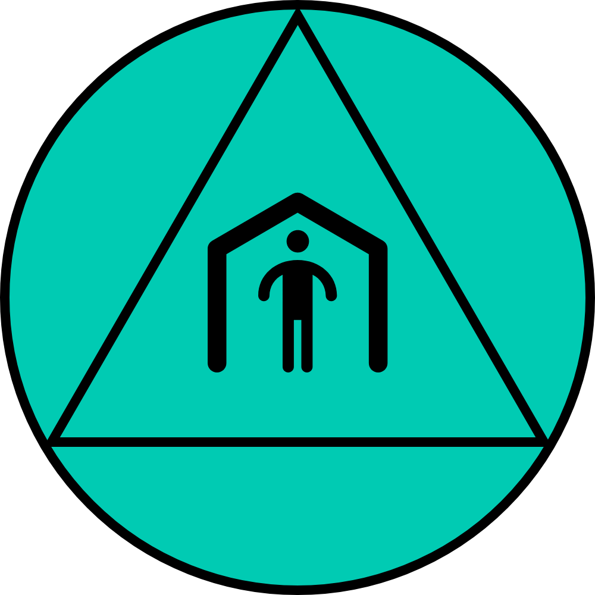

# 

DroneAid uses machine learning to detect calls for help on the ground placed by those in need. At the heart of DroneAid is a *Symbol Language* that is used to train a visual recognition model. That model analyzes video from a drone to detect and count specific images. A dashboard can be used to plot those locations on a map and initiate a response.

 

## An aerial scout for first responders

DroneAid consists of several components:
1. The DroneAid Symbol Language that represents need and quantities
2. A mechanism for rendering the symbols in virtual reality to train a model
3. The trained model that can be applied to drone livestream video
4. A dashboard that renders the location of needs captured by a drone

The current implementation can be extended beyond a particular drone to additional drones, airplanes, and satellites. The Symbol Language can be used to train additional visual recognition implementations.

The original version of DroneAid was created by Pedro Cruz in August 2018. A refactored version was released as a *Code and Response™ with The Linux Foundation* open source project in October 2019. DroneAid is currently being transferred to The Linux Foundation.

## Get started

* [The DroneAid origin story](#the-droneaid-origin-story)
* [DroneAid Symbol Language](#droneaid-symbol-language)
* [See it in action](#see-it-in-action)
* [Set up and training a visual recognition model on the Symbol Language](#set-up-and-training-a-visual-recognition-model-on-the-symbol-language)
* [Frequently asked questions](#frequently-asked-questions)
* [Project roadmap](#project-roadmap)
* [Built with](#built-with)
* [Contributing](#contributing)
* [Authors](#authors)
* [License](#license)

## The DroneAid origin story

Pedro Cruz explains his inspiration for DroneAid, based on his experience in Puerto Rico after Hurricane Maria. He flew his drone around his neighborhood and saw handwritten messages indicating what people need and realized he could standardize a solution to provide a response.

## DroneAid Symbol Language

The DroneAid Symbol Language provides a way for those affected by natural disasters to express their needs and make them visible to drones, planes, and satellites when traditional communications are not available.

Victims can use a pre-packaged symbol kit that has been manufactured and distributed to them, or recreate the symbols manually with whatever materials they have available.

These symbols include those below, which represent a subset of the icons provided by [The United Nations Office for the Coordination of Humanitarian Affairs (OCHA)](https://www.unocha.org/story/ocha-launches-500-free-humanitarian-symbols). These can be complemented with numbers to quantify need, such as the number or people who need water.

| Symbol | Meaning | Symbol | Meaning |
|--------|--------- |--------|---------|
|  | Immediate Help Needed (orange; downward triangle over SOS) |  | Shelter Needed (cyan; person standing in structure)  |
|  | No Help Needed (green; upward triangle over OK) | | First Aid Kit Needed (yellow; case with first aid cross) |
|  | Water Needed (blue; water droplet) | | Area with Children in Need (lilac; baby with diaper) |
|  | Food Needed (red; pan with wheat) |  | Area with Elderly in Need (purple; person with cane) |

## See it in action

A demonstration implementation takes the video stream of DJI Tello drone and analyzes the frames to find and count symbols. See [tello-demo](tello-demo) for instructions on how to get it running.

## Set up and training a visual recognition model on the Symbol Language

In order to train the model, we must place the symbols into simulated environments so that the system knows how to detect them in a variety of conditions (i.e. whether they are distorted, faded, or in low light conditions).

See [SETUP.md](SETUP.md)

## Frequently asked questions

See [FAQ.md](FAQ.md)

## Project roadmap

See [ROADMAP.md](ROADMAP.md)

## Built with

* [TensorFlow.js](https://www.tensorflow.org/js) - Used to run inference on the browser
* [Cloud Annotations](https://github.com/cloud-annotations/training) - Used for training the model
* [Lens Studio](https://lensstudio.snapchat.com/) - Used to create the augmented reality and generate the imageset

## Contributing

Please read [CONTRIBUTING.md](CONTRIBUTING.md) for details on our code of conduct, and the process for submitting DroneAid pull requests.

## Authors

* [Pedro Cruz](https://github.com/pedrocruzio)
* [Va Barbosa](https://github.com/vabarbosa)
* [Nick Bourdakos](https://github.com/bourdakos1)
* [John Walicki](https://github.com/johnwalicki)
* [Daniel Krook](https://github.com/krook)
* [Derek Teay](https://github.com/derekteay)
* [Wes Turner](https://github.com/westurner)

## License

This project is licensed under the Apache 2 License - see the [LICENSE](LICENSE) file for details.
