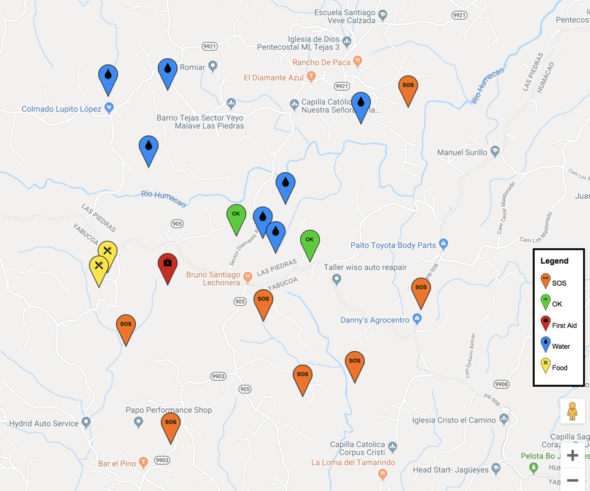

# Roadmap

DroneAid currently:

* Takes the video stream of a Tello drone and counts the number of DroneAid Symbols found.
* Contains a dashboard to fly a Tello drone.
* Works with a webcam.

Within the next months we are aiming to do:

- [ ] Complete the mapping component that will take the GPS data from reported images and plot them on map.
- [ ] Consume the pre-trained model as a Docker image.
- [ ] Extend to consumer DJI drones like the Mavic, Phantom, and Spark.
- [ ] Document steps for PowerAI and Watson Visual Recognition.
- [ ] Create a model to detect handrawn "SOS".
- [ ] Integrate reporting with the [Project OWL](https://github.com/Code-and-Response/Project-OWL) mesh network.

Longer term goals are:

* Improve the accuracy of the model by using realistic simulated enviornments (floods, earthquakes, forest fires, etc).
* Produce a basic signaling kit with "SOS" on one side and "OK" on the other.
* Create a Twitter bot that will look for tweets with a hashtag (i.e. #DroneAidSOS) for social media reporting.
* Create a custom drone that will have DroneAid embedded inside, which will not require a computer or mobile app.
* Create a reporting dashboard for first responders and non-profit relief organizations.

