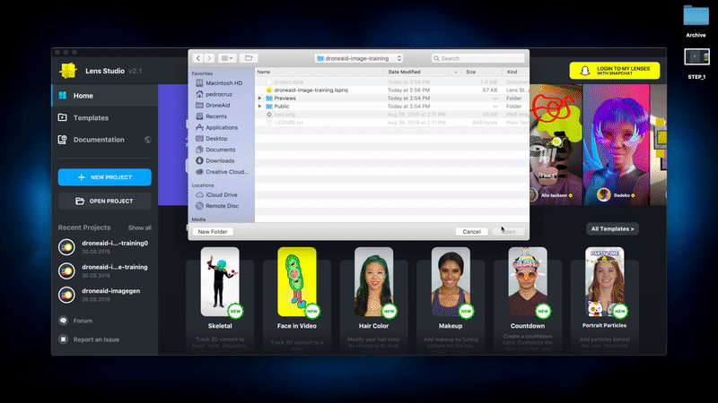

# Setup

If you are interested in learning how our model was trained and want to try it training it yourself, you can follow these steps. 

## Prerequisites

Before you begin, you'll need the following:

* A [Snapchat](https://www.snapchat.com) mobile app and account.
* Lens Studio - Download [Lens Studio](https://lensstudio.snapchat.com/download).
* FFmpeg - Install [`FFmpeg`](https://ffmpeg.org/). You can use `homebrew` to install it easily.
   ```
   $ brew install ffmpeg
   ```  
## Use Augmented Reality to generate the imageset

Download the [sample Lens Studio project](augmented-reality-image-training) to record the videos we will use to train a custom model. 

1. Open up the sample project in Lens Studio.


    
2. Duplicate the symbols into 4 objects and place them around the scene.


3. [Pair your phone to Lens Studio with the Snapchat app](https://lensstudio.snapchat.com/guides/general/pairing-to-snapchat/) and press the "Push Lens To Device" button.


4. With the Snapchat app, capture a few 10-second videos in different environments (grass, concrete, etc). You can scale up and down the symbols with "pinch-and-zoom."

5. Download the videos to your computer and use FFmpeg commands to split the videos into frames. Depending on the length of your video, you will end up with around 100-200 images. 

   ```
   $ ffmpeg -i [NAME_OF_YOUR_TRAINING_VIDEO.mp4] -vf fps=4 trainingvideo_out%d.jpg
   ```  

6. Next up, we will use the images to train our model. 

## Train the model

Follow the steps in [this tutorial](https://cloud-annotations.github.io/training/object-detection/cli/) to create the model. Once finished, download the `model_web` folder to your computer.

## Deploy the dashboard

Replace the the `model_web` folder in the `tello-demo/public` directory. Afterwards, follow the [instructions here](tello-demo) to test it out!
