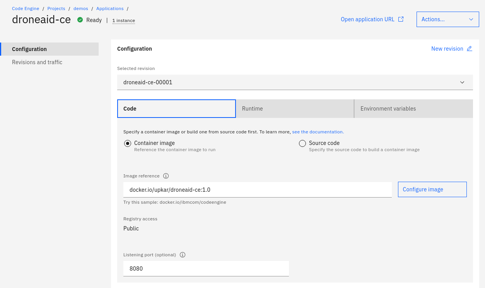

# DroneAid for TensorFlow.js Examples - Code Engine Version

## Run on Cloud

This repository contains static example that serves the [DroneAid model](https://github.com/Call-for-Code/DroneAid). The TensorFlow.js model is served with [nginx](https://nginx.org/en/) HTTP server. You can build your application in Code Engine by using the pre-built image on [Docker Hub](https://hub.docker.com/repository/docker/upkar/droneaid-ce).

## Run Locally

To run the examples:

1. Clone this repository

1. Point your web server to the `droneaid-tfjs` directory in the cloned repo

    > For example:  
    >
    > - using the **[Web Server for Chrome](https://github.com/kzahel/web-server-chrome)** extension (install it from the [Chrome Web Store](https://chrome.google.com/webstore/detail/web-server-for-chrome/ofhbbkphhbklhfoeikjpcbhemlocgigb))
    >
    >   1. Go to your Chrome browser's Apps page (chrome://apps)
    >   1. Click on the **Web Server**
    >   1. From the Web Server, click **CHOOSE FOLDER** and browse to the cloned repository directory
    >   1. Start the Web Server
    >   1. Make note of the **Web Server URL(s)** (e.g., `http://127.0.0.1:8887`)
    >
    > - using the Python **HTTP server** module
    >
    >   1. From a terminal shell, go to the cloned repository directory
    >   1. Depending on your Python version, enter one of the following commands:
    >       - Python 2.x: `python -m SimpleHTTPServer 8080`
    >       - Python 3.x: `python -m http.server 8080`
    >   1. Once started, the Web Server URL should be `http://127.0.0.1:8080`
    >

1. From the browser, access `index.html` via the Web Server's URL (e.g., `http://localhost:8080`)