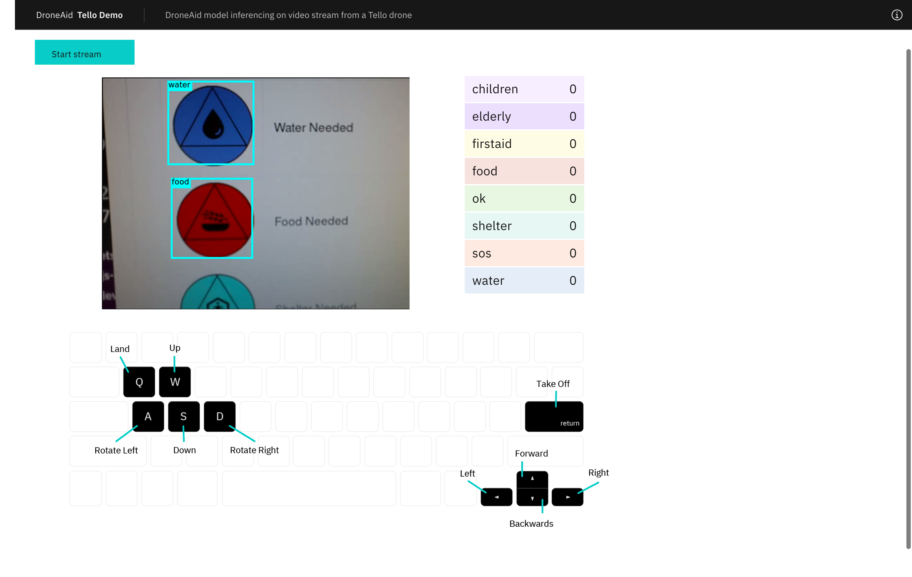

# Tello Streaming

This directory contains the instructions for viewing the streaming video from a Tello drone in the browser. The video in the browser can then be processed by TensorFlow.js and inference run against the DroneAid model.

    

## Prerequisites

1. Install [`Node.js`](https://nodejs.org)
1. Install [`FFmpeg`](https://ffmpeg.org/) (this may take awhile)
   ```
   $ brew install ffmpeg
   ```  
1. Clone this repository
   ```
   $ git clone https://github.com/Code-and-Response/DroneAid.git
   ```  
1. Change to `tello-demo` directory
   ```
   $ cd ../tello-demo
   ```  
1. Install dependencies
   ```
   $ npm install
   ```  

## Run

1. In a terminal window, start the server in the `tello-demo` directory
   ```
   $ npm start
   ```  

1. Open a browser and go to **http://127.0.0.1:3000/**.
1. Connect computer to Tello drone's WiFi
1. Click **Start stream**

You should now see a live feed from Tello drone in the browser window! If you click and enable the **Prediction** switch inference will run against the video feed with the DroneAid model (using TensorFlow.js) and the browser will display the predictions annotated onto the video.

## Notes

In some brief initial tests, the live feed (without running predictions) had less than 1sec latency. When predictions was turned on latency increased to about 1-2secs.

Further performance improvements may be possible with changes to the

- arguments passed to `ffmpeg` (in `server.js`)
- options used for `jsmpeg` (in `droneaid-tello.js`)
- DroneAid TensorFlow.js model

While `ffmpeg` is what is used here, it could be replaced with `mplayer` (or some other video streaming service/application).


## Links

- [FFmpeg](https://ffmpeg.org/)
- [jsmpeg](https://jsmpeg.com/)
- [TensorFlow.js](https://www.tensorflow.org/js/)
- [Tello](https://www.ryzerobotics.com/tello)
